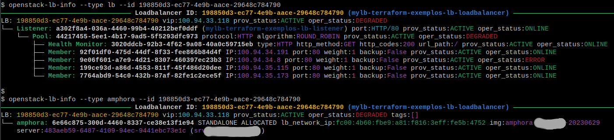

openstack-lb-info - A command-line tool for displaying OpenStack Load Balancer resource details.


[](https://github.com/thobiast/openstack-loadbalancer-info/actions/workflows/build.yml)
[](./LICENSE)
[](https://github.com/psf/black)


# About

This Python script is designed to interact with an OpenStack cloud infrastructure and retrieve information about
load balancers and their components such as listeners, pools, health monitors, members, and amphorae.
It displays the information in a visually appealing and user-friendly way and provide a clear representation
of the load balancer resources.

Below are the key features and components:

## Features

- Query and display information about OpenStack load balancers.
- Display detailed attributes and information about listeners, pools, health monitors, members, and amphorae.
- Filter results based on various criteria, such as load balancer name, ID, tags, availability zone, VIP network, and VIP subnet.
- Present information in a structured and colorful format using the Rich library.
- Support output in different formats, including Rich text, plain text, and JSON.

## Information Display

The program provides two main modes for displaying information:

1. **Load Balancer Information:** When the resource type is specified as "*lb*", it retrieves and displays
details about OpenStack load balancers. The displayed information includes load balancer IDs, VIP addresses, provisioning status,
operating status, and other optional details. If no load balancers match the filter criteria, it will indicate that
no load balancers were found.

2. **Amphora Information:** When the resource type is specified as "*amphora*", it retrieves and displays information
about amphoras associated with load balancers. Amphoras are responsible for handling load balancing operations. The displayed
information includes amphora IDs, roles, status, load balancer network IP addresses, associated images, server information,
and optional details. If no amphoras match the filter criteria, it will indicate that no amphoras were found.

## Example

```bash
$ usage: openstack-lb-info [-h] [-d] [--os-cloud OS_CLOUD] -t {lb,amphora}
                         [-o {plain,rich,json}] [--name NAME] [--id ID]
                         [--tags TAGS] [--flavor-id FLAVOR_ID]
                         [--vip-address VIP_ADDRESS]
                         [--availability-zone AVAILABILITY_ZONE]
                         [--vip-network-id VIP_NETWORK_ID]
                         [--vip-subnet-id VIP_SUBNET_ID] [--details]
                         [--no-members] [--max-workers MAX_WORKERS]

A script to show OpenStack load balancers information.

options:
  -h, --help            show this help message and exit
  --os-cloud OS_CLOUD   Name of the cloud to load from clouds.yaml.
                        (Default 'envvars', which uses OS_* env vars)
  -t {lb,amphora}, --type {lb,amphora}
                        Show information about load balancers or amphoras
  -o {plain,rich,json}, --output-format {plain,rich,json}
                        Output format. (default: rich)
  --name NAME           Filter load balancers name
  --id ID               Filter load balancers id (UUID)
  --tags TAGS           Filter load balancers tags
  --flavor-id FLAVOR_ID
                        Filter load balancers flavor id (UUID)
  --vip-address VIP_ADDRESS
                        Filter load balancers VIP address
  --availability-zone AVAILABILITY_ZONE
                        Filter load balancers AZ
  --vip-network-id VIP_NETWORK_ID
                        Filter load balancers network id (UUID)
  --vip-subnet-id VIP_SUBNET_ID
                        Filter load balancers subnet id (UUID)
  --details             Show all load balancers/amphora details. (default: False)
  --no-members          Do not show load balancers pool members information.
                        (default: False)
  --max-workers MAX_WORKERS
                        Max number of concurrent threads to fetch members details (1-32).
                        (default: 4)

    Example of use:
        openstack-lb-info
        openstack-lb-info --type lb --name my_lb
        openstack-lb-info --type lb --id load_balancer_id
        openstack-lb-info --type amphora --id load_balancer_id
        openstack-lb-info --type amphora --id load_balancer_id --details

```


## Authentication Methods

##### Environment Variables
You can manually set the required environment variables or use an OpenStack RC file to simplify the process.

##### clouds.yaml Configuration
Alternatively, you can use a *clouds.yaml* and export "*OS_CLOUD*" variable to pass the cloud name.

For more information: https://docs.openstack.org/python-openstackclient/latest/cli/man/openstack.html

## Installation

Clone or download the repository to your local machine.

#### Development mode using pip
```bash
$ pip install -e .
```

#### Development mode using pipx
```bash
$ pipx install -e .
```
## Contributing

Contributions are welcome! Please feel free to submit a Pull Request.
